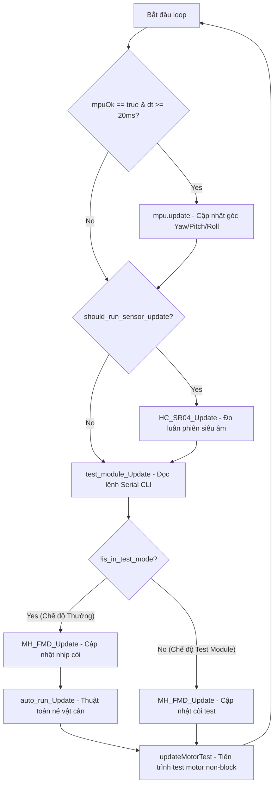

# BÁO CÁO PHÂN TÍCH KỸ THUẬT DETAILED FIRMWARE ESP32
**Dự án:** Robot Tự Hành Mecanum (Robot AI)  
**Tác giả phân tích:** Senior Embedded Engineer (ESP32 + PlatformIO + Robotics)  
**Ngày thực hiện:** 21/07/2026  

---

## 1. CẤU TRÚC PROJECT

Project được tổ chức theo chuẩn cấu trúc thư mục của **PlatformIO**, tách biệt rõ ràng giữa các phần định nghĩa phần cứng, thư viện driver, phân hệ chức năng và chương trình chính.

```text
robot_AI/
├── include/
│   ├── Config.h              # Cấu hình hằng số hệ thống, thông số vật lý xe, tần số PWM
│   └── PinMap.h              # Định nghĩa sơ đồ chân GPIO vật lý của ESP32-S3
├── lib/
│   ├── BTS7960/              # Driver điều khiển Động cơ công suất BTS7960 qua PWM
│   ├── Motor/                # Lớp Coordinator điều phối di chuyển 4 bánh Mecanum
│   ├── EncoderReader/        # Thư viện đọc xung ngắt Encoder & tính vận tốc RPM, m/s
│   ├── Kinematics/           # Động học ngược Mecanum (Chuyển vx, vy, w -> PWM 4 bánh)
│   ├── Mpu6050/              # Wrapper đọc cảm biến góc IMU 6-DOF MPU6050 (I2C)
│   ├── Sensor_HC_SR04/       # Phân hệ quản lý 2 cảm biến siêu âm (Trước/Sau) + Lọc Median
│   ├── MH_FMD/               # Phân hệ điều khiển còi cảnh báo Active Buzzer (Active Low)
│   └── Adafruit/             # Thư viện phụ trợ Adafruit MPU6050 & Unified Sensor
├── src/
│   ├── main.cpp              # Điểm khởi tạo (setup) và vòng lặp chính (loop)
│   ├── robot_global.h        # Header trung tâm chia sẻ biến toàn cục & API giữa các phân hệ
│   ├── auto_run.cpp          # Phân hệ tự động lái xe & né vật cản
│   ├── clien_dieukhien.cpp   # Phân hệ điều khiển thủ công qua Terminal CLI Serial
│   ├── test_module.cpp       # Phân hệ chẩn đoán & kiểm tra độc lập từng module hardware
│   └── test_module.h         # Header phân hệ chẩn đoán module
└── platformio.ini            # Cấu hình biên dịch PlatformIO (board ESP32-S3, build flags)
```

### Chi tiết nhiệm vụ từng Module / Subsystem:

1. **Config (`include/Config.h`)**: Lưu trữ các thông số cấu hình vật lý của xe Mecanum như số xung encoder (`PPR = 11.0`), tỉ số truyền hộp số (`GEAR_RATIO = 30.0`), đường kính bánh xe (`WHEEL_DIAMETER = 0.08m`), kích thước hình học xe (`L_X = 0.15m, L_Y = 0.15m`), tần số PWM (`15kHz`), độ phân giải PWM 8-bit và tốc độ Serial Baud (`115200`).
2. **PinMap (`include/PinMap.h`)**: Bản đồ gán chân GPIO vật lý của chip ESP32-S3 cho 4 cầu H BTS7960, 4 kênh Encoder Phase A/B, 2 bộ cảm biến siêu âm HC-SR04 (Trig/Echo Trước & Sau) và Còi báo MH-FMD.
3. **BTS7960 Driver (`lib/BTS7960`)**: Lớp điều khiển công suất động cơ DC dùng chip BTS7960. Tương thích linh hoạt với cả ESP32 Core 2.x (`ledcSetup`, `ledcAttachPin`) và Core 3.x (`ledcAttach`). Xuất tín hiệu PWM RPWM/LPWM để quay thuận, quay ngược, dừng và hãm (brake).
4. **Motor Coordinator (`lib/Motor`)**: Lớp quản lý và điều phối đồng thời 4 động cơ BTS7960 (`motorFL`, `motorFR`, `motorRL`, `motorRR`). Cung cấp các API di chuyển hình học Mecanum: tiến thẳng, lùi, di chuyển ngang (strafe left/right), xoay tại chỗ (rotate left/right), và di chuyển chéo 4 góc (diagonal).
5. **EncoderReader (`lib/EncoderReader`)**: Đọc xung vuông tốc độ cao từ 4 Encoder bánh xe bằng ngắt ngoài (External Interrupt) trên các chân Phase A. Tự động tính toán số vòng quay trên phút (RPM) và vận tốc dài ($m/s$) định kỳ mỗi 100ms.
6. **Kinematics (`lib/Kinematics`)**: Tính toán động học ngược (Inverse Kinematics) cho xe 4 bánh Mecanum. Nhận đầu vào là vận tốc tổng quát của xe $v_x, v_y, \omega$ và tính ra tốc độ PWM từng bánh xe $[-255, 255]$, tự động chuẩn hóa (normalize) nếu vượt ngưỡng.
7. **MPU6050 (`lib/Mpu6050`)**: Wrapper tích hợp thư viện `Adafruit_MPU6050`. Khởi tạo I2C trên cặp chân tùy chỉnh SDA=18, SCL=19. Đọc dữ liệu thô gia tốc (Accel X,Y,Z), con quay hồi chuyển (Gyro X,Y,Z), nhiệt độ và tính toán tích phân góc nghiêng Euler (Roll, Pitch, Yaw).
8. **Sensor_HC_SR04 (`lib/Sensor_HC_SR04`)**: Phân hệ quản lý đo khoảng cách siêu âm trước và sau. Hoạt động theo cơ chế máy trạng thái luân phiên (xen kẽ) không block CPU mỗi 60ms, tích hợp bộ lọc Median 5 mẫu để loại bỏ xung nhiễu ngẫu nhiên, tự động phát hiện lỗi ngắt nối (Offline/Stuck Echo) và cảnh báo trùng chân GPIO.
9. **MH_FMD Buzzer (`lib/MH_FMD`)**: Phân hệ phát âm thanh cảnh báo sử dụng Active Buzzer kích hoạt mức LOW (Active Low). Tự động phát các nhịp bíp dồn dập (Slow -> Fast -> Emergency) tương ứng với khoảng cách vật cản mà không dùng hàm `delay()`.
10. **clien_dieukhien (`src/clien_dieukhien.cpp`)**: Bộ giải mã lệnh Serial CLI từ máy tính. Nhận diện các phím tắt nhanh (`w`, `a`, `s`, `d`, `q`, `e`, `x`), ánh xạ lệnh ghép tốc độ (`tien 180`, `xoay_trai 200`), xử lý chuyển chế độ Manual/Auto, in debug PWM và trạng thái hệ thống.
11. **auto_run (`src/auto_run.cpp`)**: Phân hệ điều khiển xe tự động khi ở chế độ `MODE_AUTO`. Tiến thẳng tự động và tự động kích hoạt chiến thuật xoay trái tại chỗ để né vật cản khi cảm biến trước phát hiện chướng ngại vật $< 50cm$.
12. **test_module (`src/test_module.cpp`)**: Phân hệ chẩn đoán phần cứng độc lập (`MAIN_MODE_TEST`). Cung cấp menu tương tác CLI qua Serial giúp kỹ sư test độc lập từng module (HC-SR04, Motor, MPU6050, Buzzer) trước khi vận hành.

---

## 2. LUỒNG KHỞI ĐỘNG (setup)

Quá trình khởi tạo hệ thống trong `setup()` tại `src/main.cpp` diễn ra theo các bước tuần tự như sau:

```text
[1. Serial 115200 Baud]
       │
       ▼ (Chờ CDC USB kết nối tối đa 2.5s)
[2. Khởi tạo IMU MPU6050 (SDA=18, SCL=19)]
       │
       ▼ (Nếu thất bại, mpuOk=false -> Xe vẫn tiếp tục chạy)
[3. Khởi tạo 4 Driver BTS7960 (FL, FR, RL, RR)]
       │
       ▼ (Gán chân PWM, cấu hình kênh LEDC 15kHz / 8-bit)
[4. Khởi tạo Cảm biến Siêu âm HC-SR04]
       │
       ▼ (Kểm tra chập chân GPIO, cài đặt ngưỡng 50cm, chạy mode 0)
[5. Khởi tạo Còi Cảnh Báo MH-FMD (GPIO41)]
       │
       ▼ (Giải phóng JTAG GPIO41, cấu hình Active Low, cài ngưỡng 50cm)
[6. Khởi tạo các Phân hệ Chức năng]
       │  ├─ clien_dieukhien_Init()
       │  └─ auto_run_Init()
       ▼
[7. Khởi tạo Phân hệ Test Module Boot Menu]
       └─ test_module_Init() ──► (Chờ người dùng gõ '1', '2', '3' trong 10s)
                                    ├─ '1' -> MANUAL MODE (Default)
                                    ├─ '2' -> AUTO MODE
                                    └─ '3' -> MODULE TEST MODE
```

---

## 3. LUỒNG CHẠY CHÍNH (loop)

Vòng lặp `loop()` trong `src/main.cpp` hoạt động theo nguyên lý **Non-blocking Event-Driven** (Không nghẽn dòng CPU), sử dụng `millis()` để điều phối thời gian cho từng module:

### Sơ đồ luồng (Flowchart):



### Các hàm được gọi trực tiếp trong `loop()`:
1. `mpu.update()`: Đọc dữ liệu I2C và tính tích phân góc nghiêng (gọi mỗi 20ms).
2. `HC_SR04_Update()`: Chạy máy trạng thái đo siêu âm trước/sau luân phiên (gọi mỗi 60ms).
3. `test_module_Update()`: Kiểm tra bộ đệm Serial, nhận diện phím bấm CLI và điều phối chuyển mode.
4. `MH_FMD_Update(frontDist, rearDist)`: Tính toán khoảng cách vật cản nhỏ nhất và điều khiển chân còi bíp bíp theo nhịp.
5. `auto_run_Update()`: Thực thi logic tự động lái xe và né vật cản khi `currentMode == MODE_AUTO`.
6. `updateMotorTest()`: Xử lý tiến trình chạy thử tuần tự 4 bánh xe không gây block CPU.

---

## 4. ROBOT MODES

Hệ thống quản lý chế độ hoạt động theo **2 cấp quản lý**:

### A. Chế độ Vận hành Xe (`OperatingMode` trong `robot_global.h`)
- **MODE_MANUAL (Chế độ Thủ công)**: Xe nhận lệnh trực tiếp từ người dùng qua phím tắt Serial Terminal CLI (`w`, `a`, `s`, `d`, `q`, `e`, `tien 180`, v.v.).
- **MODE_AUTO (Chế độ Tự động)**: Xe tự động chạy tiến thẳng với tốc độ PWM 150. Khi cảm biến siêu âm trước phát hiện vật cản $< 50cm$, xe dừng và tự xoay trái tại chỗ cho đến khi đường thoáng $> 70cm$ (Hysteresis) mới tiếp tục tiến thẳng.

### B. Chế độ Quản lý Hệ thống (`MainMode` trong `test_module.cpp`)
- **MAIN_MODE_MANUAL (1)**: Chế độ chạy thủ công chính.
- **MAIN_MODE_AUTO (2)**: Chế độ tự động chạy né vật cản chính.
- **MAIN_MODE_TEST (3)**: Chế độ chẩn đoán module phần cứng. Tạm dừng các luồng tự động để kỹ sư test thủ công từng module (HC-SR04, Motor, MPU6050, Buzzer).

### Mode mặc định & Cơ chế chuyển Mode:
- **Mode mặc định khi boot**: `MODE_MANUAL` (Hệ thống chờ 10 giây ở menu khởi động, nếu không có lệnh sẽ tự chọn Chế độ 1).
- **Chuyển Mode thủ công**:
  - Gõ `1`, `manual`, `man`, `m` qua Serial -> Chuyển sang **MANUAL**.
  - Gõ `2`, `auto`, `run` qua Serial -> Chuyển sang **AUTO**.
  - Gõ `3`, `diagnose`, `sensor`, `test_module` qua Serial -> Chuyển sang **TEST MODULES**.
- **Chuyển Mode tự động (Bảo vệ an toàn)**:
  - Trong `auto_run.cpp`, nếu cảm biến siêu âm trước bị ngắt kết nối/hỏng (`HC_SR04_FrontOnline() == false`), hệ thống sẽ **ngay lập tức dừng xe khẩn cấp và tự động thoát từ AUTO về MANUAL** để tránh xe "chạy mù" gây va chạm (trừ khi bật cờ `bypass`).
  - Khi người dùng gửi lệnh dừng xe (`dung` hoặc `x`), hệ thống cũng tự động đưa xe từ `AUTO` về `MANUAL`.

---

## 5. CẢM BIẾN

| Cảm biến | Subsystem Directory | File triển khai | Class / Struct | Hàm đọc dữ liệu chính | Biến lưu trữ dữ liệu | Kiểu dữ liệu |
| :--- | :--- | :--- | :--- | :--- | :--- | :--- |
| **Siêu âm Trước/Sau (HC-SR04)** | `lib/Sensor_HC_SR04` | `Sensor_HC_SR04.h`<br>`Sensor_HC_SR04.cpp` | `RollingBuffer`<br>*(Struct nội bộ)* | `HC_SR04_GetFrontDistance()`<br>`HC_SR04_GetRearDistance()`<br>`HC_SR04_GetMinDistance()` | `front_buffer`<br>`rear_buffer`<br>`front_online`<br>`rear_online` | `RollingBuffer`<br>`RollingBuffer`<br>`bool`<br>`bool` |
| **IMU 6-DOF (MPU6050)** | `lib/Mpu6050` | `Mpu6050.h`<br>`Mpu6050.cpp` | `MPU6050Sensor` | `mpu.update()`<br>`mpu.getYaw()`<br>`mpu.getPitch()`<br>`mpu.getRoll()`<br>`mpu.getAccelX/Y/Z()` | `roll`, `pitch`, `yaw`<br>`accelX, accelY, accelZ`<br>`gyroX, gyroY, gyroZ` | `float` |
| **Encoder Bánh Xe (4 kênh)** | `lib/EncoderReader` | `EncoderReader.h`<br>`EncoderReader.cpp` | `EncoderReader` | `getTicks()`<br>`getRPM()`<br>`getSpeeds()` | `enc_fl_ticks`<br>`enc_fr_ticks`<br>`enc_rl_ticks`<br>`enc_rr_ticks` | `volatile long` |
| **Active Buzzer (MH-FMD)** *(Sensory Feedback)* | `lib/MH_FMD` | `MH_FMD.h`<br>`MH_FMD.cpp` | `enum BuzzerMode` | `MH_FMD_GetDistance()`<br>`MH_FMD_GetThreshold()` | `current_distance`<br>`warning_threshold`<br>`active_mode` | `float`<br>`float`<br>`BuzzerMode` |

---

## 6. ĐIỀU KHIỂN ĐỘNG CƠ

- **Driver phần cứng**: Sử dụng 4 cầu H công suất lớn **BTS7960** tương ứng với 4 bánh Mecanum. Mỗi BTS7960 sử dụng 2 chân PWM (`RPWM` và `LPWM`) kết nối với ngoại vi **ESP32 LEDC PWM** (tần số `15kHz`, độ phân giải `8-bit`, dải giá trị duty cycle `0 - 255`).
- **Lớp Coordinator (`Motor`)**: Quản lý 4 đối tượng `BTS7960`. Thực hiện tổng hợp hướng đi của xe Mecanum bằng cách điều khiển tốc độ và chiều quay của 4 bánh:
  - **Tiến (Forward)**: FL(+), FR(+), RL(+), RR(+)
  - **Lùi (Backward)**: FL(-), FR(-), RL(-), RR(-)
  - **Đi ngang trái (Strafe Left)**: FL(-), FR(+), RL(+), RR(-)
  - **Đi ngang phải (Strafe Right)**: FL(+), FR(-), RL(-), RR(+)
  - **Xoay trái (Rotate Left)**: FL(-), FR(+), RL(-), RR(+)
  - **Xoay phải (Rotate Right)**: FL(+), FR(-), RL(+), RR(-)
- **Động học Kinematics (`lib/Kinematics`)**: Cung cấp hàm `getWheelSpeeds(vx, vy, omega)` chuyển đổi từ vận tốc mong muốn của robot sang giá trị PWM 4 bánh $[-255, 255]$, tự động scale giảm tỉ lệ nếu vượt quá 255.
- **Giải thuật PID**: **PROJECT HIỆN TẠI CHƯA CÓ PID CLOSED-LOOP CONTROL**. Xe đang chạy hoàn toàn ở chế độ **Open-Loop** (vòng hở), tức là gửi trực tiếp giá trị PWM từ lệnh/kinematics ra driver mà chưa có bộ điều khiển phản hồi PID để giữ ổn định vận tốc thực tế của bánh xe.
- **Hàm cuối cùng điều khiển tốc độ motor**:
  - Tầng phần cứng thấp nhất: `ledcWrite(pin, duty)` (nằm trong hàm nội bộ `BTS7960::writePWM()`).
  - Tầng driver BTS7960: `BTS7960::setSpeed(int speed)` (nhận giá trị từ -255 đến 255).
  - Tầng Motor Coordinator: `Motor::setAllMotor(fl, fr, rl, rr)` được gọi bởi các hàm di chuyển cao cấp như `car.forward(speed)`, `car.rotateLeft(speed)`.

---

## 7. ENCODER

- **Đọc ở đâu**: Đọc trực tiếp từ phần cứng thông qua **Ngắt ngoài (External Interrupt)** trên các chân GPIO Phase A (`ENC_FL_A: 41`, `ENC_FR_A: 39`, `ENC_RL_A: 37`, `ENC_RR_A: 35`) ở sườn lên (`RISING`). Trong các hàm ngắt ISR (`ISR_FL`, `ISR_FR`, `ISR_RL`, `ISR_RR`), chương trình đọc mức logic của chân Phase B để tăng hoặc giảm biến đếm xung tích lũy `enc_fl_ticks`, `enc_fr_ticks`, `enc_rl_ticks`, `enc_rr_ticks`.
- **Cập nhật ở đâu**: Được cập nhật trong hàm `EncoderReader::update()` trong `lib/EncoderReader/EncoderReader.cpp`. Định kỳ mỗi `100ms`, hàm tính độ chênh lệch xung $\Delta tick$, quy đổi ra tần số xung, sau đó tính ra **RPM** (số vòng/phút) và **Vận tốc dài** ($m/s$) dựa trên chu vi bánh xe ($D = 0.08m$) và tỉ số truyền ($1:30$).
- **Ai sử dụng**: **HIỆN TẠI TRONG `main.cpp`, THƯ VIỆN `EncoderReader` CHƯA ĐƯỢC INSTANTIATE (TẠO ĐỐI TƯỢNG) VÀ CHƯA ĐƯỢC GỌI TRONG `loop()`**. Code đọc encoder đã được viết hoàn chỉnh trong `lib/EncoderReader` nhưng chưa được kết nối vào vòng lặp chính của firmware.

---

## 8. MPU6050

- **Đọc ở đâu**: Đọc trong hàm `setup()` (`mpu.begin(18, 19)`) và trong `loop()` của `src/main.cpp` thông qua phương thức `mpu.update()`, chạy định kỳ không block mỗi `20ms` (`MPU_INTERVAL = 20`).
- **Dữ liệu trả về**:
  - **Roll, Pitch, Yaw**: **CÓ**. Hàm `mpu.update()` đọc Gyro X, Y, Z, nhân với khoảng thời gian $dt$ và tính tích phân để cập nhật các góc `roll`, `pitch`, `yaw`. Người dùng có thể lấy qua các hàm `mpu.getRoll()`, `mpu.getPitch()`, `mpu.getYaw()`.
  - **Gia tốc (Accelerometer)**: **CÓ**. Lấy qua `mpu.getAccelX()`, `mpu.getAccelY()`, `mpu.getAccelZ()` (đơn vị $m/s^2$).
  - **Con quay hồi chuyển (Gyroscope)**: **CÓ**. Lấy qua `mpu.getGyroX()`, `mpu.getGyroY()`, `mpu.getGyroZ()` (đơn vị $rad/s$).
  - **Nhiệt độ**: **CÓ**. Lấy qua `mpu.getTemperature()` (đơn vị $^\circ C$).

---

## 9. SERIAL

- **Có dùng `Serial.begin()` không?**: **CÓ**. Trong `src/main.cpp` tại `setup()` có lệnh `Serial.begin(115200)`.
- **Có dùng `Serial.print()` không?**: **CÓ**. Dự án sử dụng rất nhiều `Serial.print()`, `Serial.println()`, và `Serial.printf()` để xuất menu trợ giúp CLI, in debug trạng thái PWM, hiển thị khoảng cách cảm biến, in log còi báo và thông tin IMU.
- **Có giao tiếp Serial với PC không?**: **CÓ**. Hiện tại dự án sử dụng giao tiếp Serial dưới dạng **Command Line Interface (CLI) văn bản ASCII (Human-readable Text)**. Người dùng từ PC mở Serial Monitor gửi các lệnh chuỗi như `w 180`, `a`, `s`, `d`, `tien 200`, `auto`, `manual`, `mpu`, `status`, `debug` để tương tác và điều khiển robot. **Chưa có giao tiếp dạng Packet nhị phân (Binary Protocol) hoặc micro-ROS**.

---

## 10. BIẾN QUAN TRỌNG

| Tên biến | File khai báo/Định nghĩa | Kiểu dữ liệu | Nhiệm vụ / Ý nghĩa |
| :--- | :--- | :--- | :--- |
| `motorFL`, `motorFR`, `motorRL`, `motorRR` | `src/main.cpp` | `BTS7960` | 4 đối tượng điều khiển 4 driver động cơ BTS7960 |
| `car` | `src/main.cpp` | `Motor` | Đối tượng Coordinator điều phối hướng chạy 4 bánh Mecanum |
| `mpu` | `src/main.cpp` | `MPU6050Sensor` | Đối tượng quản lý và giao tiếp cảm biến IMU MPU6050 |
| `mpuOk` | `src/main.cpp` | `bool` | Cờ ghi nhận trạng thái khởi tạo thành công của MPU6050 |
| `currentMode` | `src/main.cpp` | `OperatingMode` | Trạng thái chế độ xe (`MODE_MANUAL` hoặc `MODE_AUTO`) |
| `currentMainMode` | `src/test_module.cpp` | `MainMode` | Chế độ quản lý chính (`MAIN_MODE_MANUAL`, `AUTO`, `TEST`) |
| `activeTestModule` | `src/test_module.cpp` | `TestModule` | Module đang được chọn kiểm tra trong chế độ Test (1-5) |
| `currentMoveDir` | `src/main.cpp` | `String` | Chuỗi mô tả hướng di chuyển hiện tại (VD: "tien", "xoay_trai") |
| `currentSpeed` | `src/main.cpp` | `int` | Giá trị tốc độ PWM hiện tại (0 - 255) |
| `isAvoidanceActive` | `src/main.cpp` | `bool` | Cờ báo xe đang trong tiến trình xoay né vật cản tự động |
| `autoModeStartTime` | `src/main.cpp` | `unsigned long` | Thời điểm bắt đầu bật chế độ AUTO (để chờ ổn định 1.5s) |
| `bypassSensorCheck` | `src/main.cpp` | `bool` | Cờ cho phép bỏ qua lỗi cảm biến siêu âm offline để test AUTO |
| `OBSTACLE_TRIGGER_CM` | `src/main.cpp` | `const float` | Ngưỡng khoảng cách kích hoạt né vật cản (50.0 cm) |
| `OBSTACLE_CLEAR_CM` | `src/main.cpp` | `const float` | Ngưỡng khoảng cách an toàn để tiếp tục tiến thẳng (70.0 cm) |
| `front_online`, `rear_online` | `lib/Sensor_HC_SR04/Sensor_HC_SR04.cpp` | `static bool` | Cờ giám sát trạng thái kết nối phần cứng 2 cảm biến siêu âm |
| `front_buffer`, `rear_buffer` | `lib/Sensor_HC_SR04/Sensor_HC_SR04.cpp` | `RollingBuffer` | Bộ đệm lưu 5 mẫu đo khoảng cách siêu âm phục vụ lọc Median |
| `enc_fl_ticks`, `enc_fr_ticks` ... | `lib/EncoderReader/EncoderReader.cpp` | `volatile long` | Biến đếm số xung đĩa encoder tích lũy từ ngắt phần cứng ISR |
| `warning_threshold` | `lib/MH_FMD/MH_FMD.cpp` | `static float` | Ngưỡng khoảng cách kích hoạt còi báo động kêu bíp bíp (50cm) |

---

## 11. HÀM QUAN TRỌNG

Dưới đây là 20 hàm quan trọng nhất trong toàn bộ hệ thống firmware:

1. `setup()` (`src/main.cpp`): Hàm khởi tạo hệ thống, thiết lập Serial, I2C, PWM động cơ, siêu âm, còi và bật menu boot.
2. `loop()` (`src/main.cpp`): Vòng lặp điều phối chính không block CPU, quản lý thời gian cập nhật IMU, Siêu âm, CLI và Auto run.
3. `auto_run_Update()` (`src/auto_run.cpp`): Thuật toán tự động lái xe tiến thẳng và xoay trái né vật cản khi có chướng ngại vật $< 50cm$.
4. `clien_dieukhien_Update()` (`src/clien_dieukhien.cpp`): Quản lý luồng nhận chuỗi Serial CLI và gọi hàm phân tích lệnh điều khiển thủ công.
5. `processCommand(String cmd)` (`src/clien_dieukhien.cpp`): Tách cú pháp lệnh CLI, ánh xạ ký tự phím tắt (`w,a,s,d`) và thực thi điều khiển xe.
6. `test_module_Update()` (`src/test_module.cpp`): Xử lý menu chẩn đoán phần cứng độc lập, nhận phím chọn test module 1-5.
7. `Motor::setAllMotor(fl, fr, rl, rr)` (`lib/Motor/Motor.cpp`): Cài đặt tốc độ PWM đồng thời cho 4 bánh xe Mecanum.
8. `Motor::forward(speed)` (`lib/Motor/Motor.cpp`): Điều khiển xe tiến thẳng bằng cách phát PWM dương cho cả 4 bánh.
9. `Motor::rotateLeft(speed)` (`lib/Motor/Motor.cpp`): Điều khiển xe xoay trái tại chỗ (bánh trái quay lùi, bánh phải quay tiến).
10. `BTS7960::setSpeed(int speed)` (`lib/BTS7960/BTS7960.cpp`): Nhận giá trị tốc độ $[-255, 255]$ và xuất xung PWM ra RPWM/LPWM.
11. `BTS7960::writePWM(pin, channel, duty)` (`lib/BTS7960/BTS7960.cpp`): Hàm wrapper tương thích cả ESP32 Core 2.x và 3.x để gọi `ledcWrite`.
12. `MPU6050Sensor::begin(sda, scl)` (`lib/Mpu6050/Mpu6050.cpp`): Khởi tạo giao tiếp Wire I2C tùy chỉnh SDA/SCL và cấu hình MPU6050.
13. `MPU6050Sensor::update()` (`lib/Mpu6050/Mpu6050.cpp`): Đọc gia tốc/gyro và tính tích phân góc Euler (Roll, Pitch, Yaw) theo thời gian real-time.
14. `HC_SR04_Init()` (`lib/Sensor_HC_SR04/Sensor_HC_SR04.cpp`): Khởi tạo GPIO siêu âm, giải phóng JTAG, xóa đệm lọc Median và kiểm tra trùng chân.
15. `HC_SR04_Update()` (`lib/Sensor_HC_SR04/Sensor_HC_SR04.cpp`): Máy trạng thái không block đo siêu âm trước/sau luân phiên mỗi 60ms.
16. `readSensor(name, trigPin, echoPin)` (`lib/Sensor_HC_SR04/Sensor_HC_SR04.cpp`): Phát xung Trigger $10\mu s$, đo thời gian Echo bằng `pulseIn` có timeout 30ms.
17. `HC_SR04_GetFrontDistance()` (`lib/Sensor_HC_SR04/Sensor_HC_SR04.cpp`): Lấy khoảng cách siêu âm phía trước đã qua bộ lọc Median 5 mẫu.
18. `MH_FMD_Update(front, rear)` (`lib/MH_FMD/MH_FMD.cpp`): Tính toán nhịp bíp bíp của còi (Slow/Fast/Emergency) dựa trên khoảng cách nhỏ nhất.
19. `EncoderReader::update()` (`lib/EncoderReader/EncoderReader.cpp`): Cập nhật số xung tích lũy từ ngắt ISR mỗi 100ms để tính ra RPM và vận tốc $m/s$.
20. `Kinematics::getWheelSpeeds(vx, vy, omega)` (`lib/Kinematics/Kinematics.cpp`): Quy đổi vận tốc mong muốn của robot ($v_x, v_y, \omega$) thành PWM 4 bánh.

---

## 12. ĐIỂM CHÈN GIAO TIẾP ROS2

*(PHÂN TÍCH KIẾN TRÚC - KHÔNG VIẾT CODE / KHÔNG SỬA CODE)*

Nếu muốn ESP32 giao tiếp với Raspberry Pi / PC chạy ROS2 qua cổng USB Serial, kiến trúc nên được mở rộng như sau:

### 1. Nơi thêm Module mới
- **Thêm thư viện Protocol mới**: Nên tạo một thư viện riêng tại `lib/ROS2SerialProtocol/` (hoặc `lib/RosBridge/`) bao gồm `ROS2SerialProtocol.h` và `ROS2SerialProtocol.cpp`. Module này đóng vai trò:
  - Đóng gói (Serialization) và giải mã (Deserialization) khung dữ liệu nhị phân (Binary Packet Framing với Header `0xFF 0xFE`, Payload, CRC16) hoặc tích hợp **micro-ROS (Micro-XRCE-DDS)**.
- **Thêm file quản lý Bridge trong `src/`**: Tạo `src/ros2_bridge.cpp` và `src/ros2_bridge.h` để làm cầu nối giữa giao thức Serial và các module phần cứng hiện có (`car`, `mpu`, `encoder`, `HC_SR04`).

### 2. Điểm chèn Nhận Lệnh vận tốc từ Raspberry Pi (`cmd_vel`)
- **Vị trí**: Trong `loop()` tại `src/main.cpp`, chèn một hàm `ros2_bridge_Update()`.
- **Luồng xử lý**:
  - Khi Raspberry Pi gửi gói tin `geometry_msgs/msg/Twist` ($linear.x, linear.y, angular.z$), `ros2_bridge` giải mã ra $v_x, v_y, \omega$.
  - Gọi hàm động học nghịch: `WheelSpeeds speeds = kinematics.getWheelSpeeds(vx, vy, omega);`
  - Truyền trực tiếp tốc độ PWM xuống 4 bánh: `car.setAllMotor(speeds.fl, speeds.fr, speeds.rl, speeds.rr);`

### 3. Điểm chèn Gửi Dữ Liệu Cảm Biến về Raspberry Pi
- **Dữ liệu IMU (`sensor_msgs/msg/Imu`)**:
  - Đọc từ đối tượng `mpu`: lấy `getAccelX/Y/Z()`, `getGyroX/Y/Z()`, `getYaw()`.
  - Đóng gói vào struct telemetry và gửi lên Pi với tần suất 50Hz (mỗi 20ms trong `loop()`).
- **Dữ liệu Encoder / Odometry (`nav_msgs/msg/Odometry` / `sensor_msgs/msg/JointState`)**:
  - Khởi tạo đối tượng `EncoderReader encoder;` trong `main.cpp` và gọi `encoder.update()` trong `loop()`.
  - Đọc `encoder.getTicks(...)` hoặc `encoder.getSpeeds(...)` để gửi số xung tích lũy 4 bánh hoặc vận tốc bánh xe về Pi để Pi tính toán Odometry 2D.
- **Dữ liệu Siêu âm / Range (`sensor_msgs/msg/Range`)**:
  - Đọc từ `HC_SR04_GetFrontDistance()` và `HC_SR04_GetRearDistance()`, quy đổi từ $cm$ sang $m$, đóng gói gửi về Pi mỗi 60ms.
- **Dữ liệu Pin / Battery State (`sensor_msgs/msg/BatteryState`)**:
  - Đọc giá trị điện áp từ chân ADC kết nối với mạch chia áp Pin (cần bổ sung thêm module đọc ADC), gửi về Pi.

---

## 13. SƠ ĐỒ KIẾN TRÚC HỆ THỐNG

```text
┌─────────────────────────────────────────────────────────────────────────────┐
│                            HARDWARE LAYER (ESP32-S3)                        │
│  [BTS7960 Drivers]  [4x Encoders]   [MPU6050 IMU]   [2x HC-SR04]  [MH-FMD]  │
└───────▲─────────────────▲─────────────────▲──────────────▲───────────▲──────┘
        │                 │                 │              │           │
        │ PWM (LEDC)      │ Interrupt (ISR) │ I2C (Wire)   │ GPIO/Pulse│ GPIO (Active Low)
┌───────┴─────────────────┴─────────────────┴──────────────┴───────────┴──────┐
│                            DRIVER & LIBRARY LAYER                           │
│  ┌──────────────┐  ┌──────────────┐  ┌──────────────┐  ┌───────────┐ ┌─────┐ │
│  │   BTS7960    │  │EncoderReader │  │  MPU6050     │  │ HC_SR04   │ │MH_  │ │
│  │ (writePWM)   │  │ (update/RPM) │  │(update/Yaw)  │  │(Median 5) │ │FMD  │ │
│  └──────▲───────┘  └──────▲───────┘  └──────▲───────┘  └─────▲─────┘ └──▲──┘ │
└─────────┼─────────────────┼─────────────────┼────────────────┼──────────┼───┘
          │                 │                 │                │          │
┌─────────┼─────────────────┼─────────────────┼────────────────┼──────────┼───┐
│         │                 │ CONTROL & KINEMATICS LAYER       │          │   │
│  ┌──────┴───────┐         │          ┌──────┴───────┐        │          │   │
│  │    Motor     │         │          │  Kinematics  │        │          │   │
│  │(Coordinator) │         │          │(Inverse Kin) │        │          │   │
│  └──────▲───────┘         │          └──────────────┘        │          │   │
└─────────┼─────────────────┼──────────────────────────────────┼──────────┼───┘
          │                 │                                  │          │
┌─────────┼─────────────────┼──────────────────────────────────┼──────────┼───┐
│         │                 │ APPLICATION LAYER                │          │   │
│  ┌──────┴────────┐  ┌─────┴────────┐                     ┌───┴──────────┴─┐ │
│  │clien_dieukhien│  │  auto_run    │                     │  test_module   │ │
│  │ (Manual CLI)  │  │ (Avoidance)  │                     │  (Diagnostics) │ │
│  └──────▲────────┘  └─────▲────────┘                     └───────▲────────┘ │
└─────────┼─────────────────┼──────────────────────────────────────┼──────────┘
          │                 │                                      │
┌─────────┴─────────────────┴──────────────────────────────────────┴──────────┐
│                            ORCHESTRATION LAYER                              │
│                                 src/main.cpp                                │
│                          setup()  <───>  loop()                             │
└─────────────────────────────────────▲───────────────────────────────────────┘
                                      │ Serial (USB CDC / UART0)
                                      ▼
                           [PC / Serial Terminal] 
                  (Điểm mở rộng tương lai: ROS2 / micro-ROS)
```

---

## 14. DẠNG FILE QUAN TRỌNG NHẤT

Danh sách sắp xếp các file theo mức độ quan trọng từ cao xuống thấp:

1. [main.cpp](file:///e:/robot_AI/ROBOT_AI/src/main.cpp): Core điều phối chính của firmware, quản lý khởi tạo phần cứng và vòng lặp loop real-time.
2. [robot_global.h](file:///e:/robot_AI/ROBOT_AI/src/robot_global.h): Header trung tâm chia sẻ tất cả biến toàn cục, struct và prototype hàm giữa các phân hệ.
3. [clien_dieukhien.cpp](file:///e:/robot_AI/ROBOT_AI/src/clien_dieukhien.cpp): Phân hệ giải mã lệnh Serial CLI, tiếp nhận lệnh lái xe thủ công từ người dùng.
4. [auto_run.cpp](file:///e:/robot_AI/ROBOT_AI/src/auto_run.cpp): Phân hệ tự động điều khiển xe chạy tiến và né vật cản an toàn.
5. [Motor.cpp](file:///e:/robot_AI/ROBOT_AI/lib/Motor/Motor.cpp) & [Motor.h](file:///e:/robot_AI/ROBOT_AI/lib/Motor/Motor.h): Lớp Coordinator tính toán hướng chạy Mecanum 4 bánh.
6. [BTS7960.cpp](file:///e:/robot_AI/ROBOT_AI/lib/BTS7960/BTS7960.cpp) & [BTS7960.h](file:///e:/robot_AI/ROBOT_AI/lib/BTS7960/BTS7960.h): Driver điều khiển PWM phần cứng xuất ra cầu H BTS7960.
7. [Sensor_HC_SR04.cpp](file:///e:/robot_AI/ROBOT_AI/lib/Sensor_HC_SR04/Sensor_HC_SR04.cpp) & [Sensor_HC_SR04.h](file:///e:/robot_AI/ROBOT_AI/lib/Sensor_HC_SR04/Sensor_HC_SR04.h): Module đọc khoảng cách siêu âm luân phiên không block CPU kèm lọc Median.
8. [Mpu6050.cpp](file:///e:/robot_AI/ROBOT_AI/lib/Mpu6050/Mpu6050.cpp) & [Mpu6050.h](file:///e:/robot_AI/ROBOT_AI/lib/Mpu6050/Mpu6050.h): Module đọc và tính toán góc nghiêng IMU MPU6050.
9. [test_module.cpp](file:///e:/robot_AI/ROBOT_AI/src/test_module.cpp) & [test_module.h](file:///e:/robot_AI/ROBOT_AI/src/test_module.h): Phân hệ menu boot và chẩn đoán phần cứng module độc lập.
10. [MH_FMD.cpp](file:///e:/robot_AI/ROBOT_AI/lib/MH_FMD/MH_FMD.cpp) & [MH_FMD.h](file:///e:/robot_AI/ROBOT_AI/lib/MH_FMD/MH_FMD.h): Module phát âm thanh cảnh báo còi Active Buzzer.
11. [EncoderReader.cpp](file:///e:/robot_AI/ROBOT_AI/lib/EncoderReader/EncoderReader.cpp) & [EncoderReader.h](file:///e:/robot_AI/ROBOT_AI/lib/EncoderReader/EncoderReader.h): Module đọc xung ngắt ISR 4 đĩa encoder và tính RPM.
12. [Kinematics.cpp](file:///e:/robot_AI/ROBOT_AI/lib/Kinematics/Kinematics.cpp) & [Kinematics.h](file:///e:/robot_AI/ROBOT_AI/lib/Kinematics/Kinematics.h): Module tính toán động học nghịch Mecanum.
13. [Config.h](file:///e:/robot_AI/ROBOT_AI/include/Config.h): File chứa hằng số thông số vật lý và tần số PWM.
14. [PinMap.h](file:///e:/robot_AI/ROBOT_AI/include/PinMap.h): File định nghĩa sơ đồ chân GPIO phần cứng ESP32-S3.
15. [platformio.ini](file:///e:/robot_AI/ROBOT_AI/platformio.ini): File cấu hình PlatformIO build flags và thư viện phụ thuộc.

---

## 15. TỔNG KẾT

**"Tôi đã hiểu toàn bộ project."**

### 1. Điểm mạnh (Strengths)
- **Kiến trúc Modular cực kỳ xuất sắc**: Các thư viện driver được thiết kế theo hướng đối tượng (OOP), phân tách rõ ràng giữa phần cứng (`lib/`) và ứng dụng (`src/`).
- **Hoàn toàn Non-blocking**: Vòng lặp `loop()` xử lý thời gian thực bằng `millis()` thay vì dùng `delay()`, giúp hệ thống duy trì tốc độ đáp ứng cao.
- **Tính năng Chẩn đoán Phần cứng (Diagnostics) mạnh mẽ**: Có chế độ `test_module` cho phép kỹ sư kiểm tra từng chân GPIO, từng motor, từng cảm biến trước khi chạy xe.
- **Khả năng Lọc nhiễu Cảm biến tốt**: Cảm biến siêu âm HC-SR04 được áp dụng bộ lọc Median 5 mẫu, khắc phục triệt me hiện tượng văng nhiễu khoảng cách.
- **Tương thích ESP32 SDK rộng**: Driver BTS7960 tự động tương thích cả ESP32 Core 2.x và 3.x.

### 2. Điểm yếu (Weaknesses)
- **Thiếu vòng điều khiển kín (Closed-Loop PID Control)**: Mặc dù đã có code `EncoderReader` nhưng chưa tích hợp bộ điều khiển PID theo vận tốc thực tế, dẫn đến xe chạy bị lệch hướng khi ma sát 4 bánh không đều.
- **Chưa instantiate `EncoderReader` trong `main.cpp`**: Thư viện encoder đã viết nhưng chưa tạo đối tượng toàn cục trong `main.cpp` để đọc xung liên tục.
- **Góc Yaw MPU6050 bị trôi (Drift)**: Tích hợp góc Yaw đơn thuần từ Gyro Z mà chưa áp dụng bộ lọc bổ sung (Complementary Filter) hay Kalman Filter kết hợp Accel/Mag.
- **Giao thức Serial dạng Text đơn giản**: Chưa sử dụng Binary Packet (Checksum/CRC) nên dễ bị nhiễu chuỗi chữ khi truyền với tốc độ cao.

### 3. Module nên mở rộng (Modules to Expand)
- **PID Velocity Controller**: Kết hợp `EncoderReader` và `BTS7960` để điều khiển chính xác tốc độ vòng kín ($RPM$) cho từng bánh.
- **Sensor Fusion Filter (Kalman/Madgwick Filter)**: Lọc bù góc nghiêng Roll/Pitch/Yaw cho MPU6050 để chống trôi góc theo thời gian.
- **Battery Monitor**: Thêm tính năng đọc điện áp pin qua ADC ESP32-S3 để cảnh báo pin yếu tránh sụt áp driver.

### 4. Module chưa có (Missing Modules)
- **ROS2 Transport Protocol Node / Bridge**: Module đóng gói nhị phân (Binary Framing / micro-ROS) truyền nhận dữ liệu với ROS2.
- **Odometry Calculation Module**: Module tính toán vị trí $(x, y, \theta)$ tích lũy của robot Mecanum từ 4 encoder bánh xe.

### 5. Nơi phù hợp nhất để thêm giao tiếp ROS2
- **Tạo Module Driver Protocol**: Thêm thư viện `lib/ROS2SerialProtocol` đảm nhận việc đóng/mở gói dữ liệu nhị phân (`cmd_vel`, `imu`, `odom`, `range`).
- **Điểm chèn chính trong Firmware**: Thêm hàm `ros2_bridge_Update()` trực tiếp vào vòng lặp `loop()` tại [main.cpp](file:///e:/robot_AI/ROBOT_AI/src/main.cpp#L102), gọi hàm `kinematics.getWheelSpeeds()` để chuyển lệnh `cmd_vel` thành PWM cho `car.setAllMotor()`.
