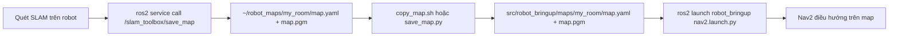

# Map Management Guide

## Luồng lưu và sử dụng map



## Lưu map sau khi quét SLAM

### Cách 1: Dùng script tự động (khuyên dùng)

```bash
# Trong terminal đang chạy SLAM
ros2 run robot_bringup save_map.py my_room
```

Script sẽ:
1. Gọi service `/slam_toolbox/save_map`
2. Copy `map.yaml` và `map.pgm` vào `src/robot_bringup/maps/my_room/`
3. Báo thành công

### Cách 2: Thủ công

```bash
# 1. Tạo thư mục
mkdir -p ~/robot_maps/my_room

# 2. Gọi service lưu map
ros2 service call /slam_toolbox/save_map slam_toolbox/srv/SaveMap \
  "name: '$HOME/robot_maps/my_room'"

# 3. Copy vào package
cp ~/robot_maps/my_room/map.yaml src/robot_bringup/maps/my_room/
cp ~/robot_maps/my_room/map.pgm src/robot_bringup/maps/my_room/
```

### Cách 3: Dùng bash script

```bash
ros2 run robot_bringup copy_map.sh
```

## Build lại package sau khi copy map

```bash
cd ~/robot_ws
colcon build --packages-select robot_bringup
source install/setup.bash
```

## Chạy Nav2 với map đã lưu

### Cách 1: Dùng launch file có sẵn default map

```bash
cd ~/robot_ws
source install/setup.bash

# Launch full Nav2 stack với map mặc định ~/robot_maps/my_room
ros2 launch robot_bringup nav2.launch.py
```

### Cách 2: Chỉ chạy localization (map_server + AMCL)

```bash
ros2 launch robot_bringup localization.launch.py
```

### Cách 3: Chỉ chạy Nav2 stack (không cần lại SLAM)

```bash
# Terminal 1: Robot bringup (Lidar + Serial + TF)
ros2 launch robot_bringup minimal.launch.py

# Terminal 2: Nav2
ros2 launch robot_bringup nav2.launch.py
```

## Cấu trúc map

```
src/robot_bringup/maps/
└── my_room/
    ├── map.yaml    # metadata (resolution, origin, thresholds)
    └── map.pgm     # hình ảnh bản đồ (grayscale)
```

## Lưu ý quan trọng

1. **Map phải có trong package share** để Nav2 load được qua `ament_index`
2. **Sau khi copy map, phải build lại package**
3. **Nếu muốn đổi map mặc định**, sửa `nav2.launch.py` hoặc truyền argument:
   ```bash
   ros2 launch robot_bringup nav2.launch.py map:=/path/to/other_map.yaml
   ```
4. **File map.pgm** là ảnh grayscale; đen = vật cản, trắng = free space, xám = unknown
5. **Chạy SLAM + Save map + Copy map + Build + Launch Nav2** là chuẩn workflow

## Troubleshooting

- Map không load được: kiểm tra path `map.yaml`, build lại package
- AMCL không converge: đặt robot gần vị trí đã biết trong map, dùng `2D Pose Estimate`
- Robot bám tường không khớp: điều chỉnh `amcl_params.yaml` (alpha1-4, laser_sigma_hit)
